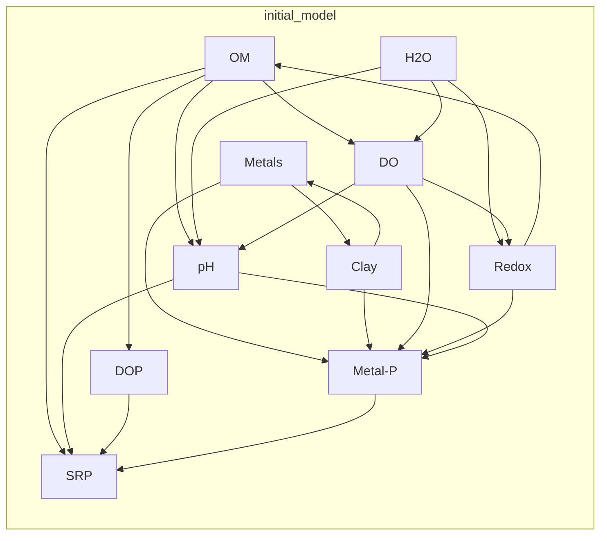
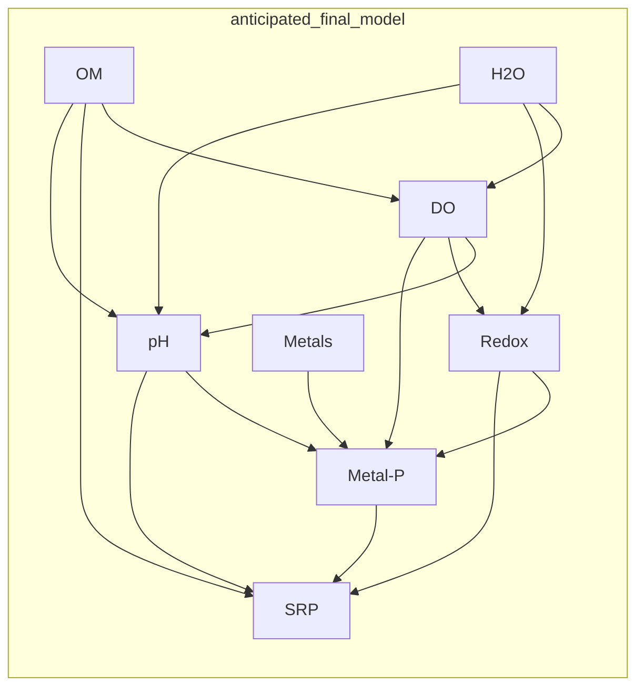

BIO381 - HW#2 - Adrian Wiegman - 1/24/2018

##Assignment
Produce 2 diagrams based on your thesis research and publish them on a markdown webpage ([instructions linked here](https://gotellilab.github.io/Bio381/Homeworks/Homework02.html))


##Research Overview
**Objective:** Dertermine the signficant factors influencing soluble reactive phosphorus concentration in wetland soils. 

Wetlands are often thought to retain phosphorus (P) due to their ability to trap sediment. However wetlands facilitate nutrient transformations and can become sources of dissolved P. My research seeks to develop tools based on biogeochemistry to predict water soluble reactive phosphorus (SRP) concentration in wetlands. The data that I will rely on can be obtained from analysis of soil, including soil cores, intact core incubations, benthic chamber analysis, and porewater equilibration. Common labratory procedures and field experiments are able to give estimates of 1. organic matter (% d.w.), 2. moisture content (% total weight), 3. poorly crystaline and amorphous metals (M-P) (Fe, Al, Mg, Ca % d.w.), 4. clay content (% d.w.), 5. Dissolved Oxygen, 6. Redox potential (mV), 7. pH, 8. Total P (TP), 9. Metal bound P (M-P), 10. SRP. As I construct a model to predict SRP,  I will consider interactions and the statistical strength of the relation between the above variables. In the first diagram below I use a structural equation model to  map out all the possible interactions. In the second diagram I use a decision tree to map out the possible iterations of the model based on the outcome of statistical tests. 
###Structural Equation Model (Path Analysis)

###Decision Tree
```mermaid
graph TD
	m_1[initial model] --> 1[1. check for colinearity]
	1 --> 1a[yes]
	1 --> 1b[no]
		1b --> 1c[stop analysis]
	1a --> 2[2. remove colinear variable that has fewest nodes and check model significance]
	2 --> 2a[significant]
		2a --> 3[3. repeat steps 1-2]
			3 --> 1
	2 --> 2b[not significant]
		2b --> 4[4. return variable and stop analysis]
		4 --> 5[final model]
end
```



##Flowchart Examples
[mermaid documentation](https://mermaidjs.github.io/)
[additional mermaid examples](https://mermaidjs.github.io/flowchart.html)
[more examples here](http://support.typora.io/Draw-Diagrams-With-Markdown/)