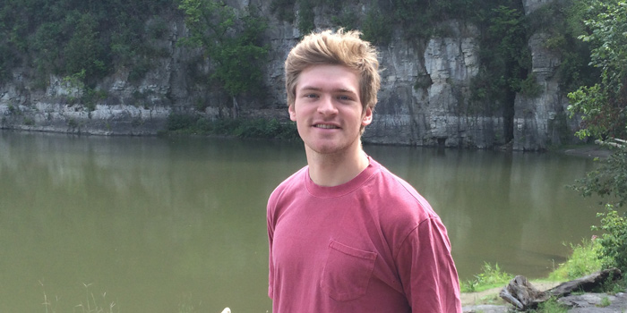

```{r setup, include=FALSE}
knitr::opts_chunk$set(echo = TRUE)
```
## R Package Demo

`stringr` lesson

  - [html](stringr_lesson/stringr_lesson.html)
  
  - [R markdown](stringr_lesson/stringr_lesson.Rmd)
  
  - [R script](stringr_lesson/stringr_demo.R)

## Homework

Homework 1: setup BIO381 webpage

[Homework 2](Homework/homework02.html): Flow charts and structural equation models

[Homework 3](Homework/homework03.pdf): Beamer presentation

[Homework 4](Homework/homework04.html): Arrithmetic and vector operations in R

[Homework 5](Homework/homework05.html): Regular expressions

[Homework 6](Homework/homework06.html): Probability distributions on hydrologic data

[Homework 7](Homework/homework07.html): Functional programming

[Homework 9](Homework/homework09_segmented.html): Improved functional programing 
    
[Homework 10](Homework/homework10.html): Batch processing of files

[Homework 11](Homework/Homework11.html): Visualizing mathematical models and randomization tests
    
[Homework 12](Homework/homework12.html): Advanced plotting with ggplot2 and patchwork

  - STATUS: incomplete,20180426
  
    - Need to select dataset to make plots with

## Info

Graduate Research Assisstant

University of Vermont

  - Rubenstein School for Environment and Natural Resources
  
  - Gund Institute for Environment
  
  - Nutrient Cycling and Ecological Design Lab
  

*Office:* 

204 Johnson House, 617 Main Street, Burlington VT

*Email:* 

adrian.wiegman@uvm.edu

## Bio

Adrian is a PhD student in the Nutrient Cycling and Ecological Design Lab at UVM. His current research is focused on quantifying energy, material, and financial tradeoffs of organic waste management. This research is motivated by the societal need to establish a circular phosphorus fertilizer system for long term sustainability of agriculture. Adrian is broadly interested in integrating natural systems science with economics in order to guide sustainable natural resource policy and management.




## Find Adrian Around the Web 

- [**ResearchGate**](https://www.researchgate.net/profile/Adrian_Wiegman)
- [**Gund Institute**](https://www.uvm.edu/gund/profiles/adrian-wiegman)
- [**Nutrient Cycling and Ecological Design Lab**](http://nced.weebly.com/team.html)
